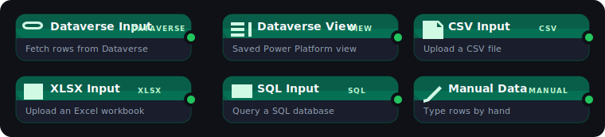
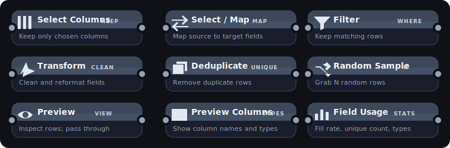
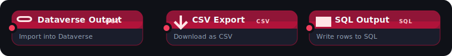

# CrossMigrate

Visual ETL pipeline builder with first-class Microsoft Dataverse support.

## Setup

```bash
npm run install:all
npm run dev
```

- Frontend: http://localhost:5173
- Backend:  http://localhost:3001

Drag nodes from the left palette onto the canvas, connect them with edges, click Run.

## Source Nodes



## Transform Nodes



## Destination Nodes



## Test pipeline

CSV input → SelectMap → Filter → DataverseOutput (entity: `contacts`) using
`~/Projects/crossmigration/data/test_contacts.csv`.

## License

This project is licensed under the [GNU General Public License v3.0](LICENSE).

Copyright © 2026 Miles Labrador. All rights reserved.
